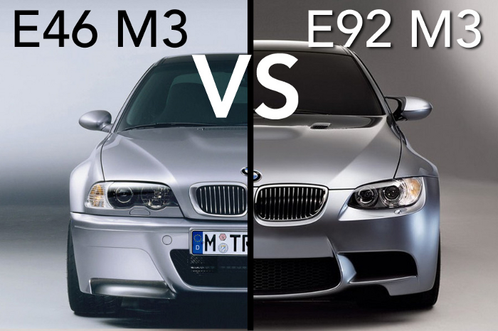

# NLP to classify BMW E46 and E90s.

## Overview

BMW manufactures many models of high performance luxury cars. One of the very popular model is the 3-Series, or known as the 'E'- series until end of model year 2013 in BMW's internal code and by many BMW enthusiast.

E46 was the 3-Series model production from 1997 to 2006. It consist of model such as 330i, 325, and the high performance model M3. E90 was the succssor to E46, from 2007 to 2013. it had models like 330i, 328i, 335i, 335is and the high performance model (also the last V8 engine) M3. During these production years of E90, it became E91 and E92 as BMW make minor changes and fixes.

Despite the many changes of E46 to E90, the fun and exciting driving experiences remain but the common issues due to age also remain. Thus, they were very identical in many ways but also different in many ways.

## Problem Statement

From Reddit, gather posts from subreddit of E46 and E90. Combine the post together and use NLP to classify the post for E46 and E90.

## Process

### 1) Data Gathering

PushShift' API was use to collect post from subreddit of E46 and E90 . A total of 2062 non-duplicated raw post were gathered for E46 and 1906 post for E90. For each post, only the title of the post, the self text and the its subreddit group E46 or E90, were gathered. 

Data Dictionary:

|Subreddit|Total Data|Data Features
|---|---|---|
E46|2062|title, selftext, subreddit
E90|1906|title, selftext, subreddit

### 2) Data Cleaning
   
E46 and E90 dataframe were combined together into 1 dataframe. For each subreddit, there were empty posts and posts with links. Since NLP can't learn from link's URL and empty posts, these rows were dropped. In additional, HTML artifacts(/n, <a, etc) that were left inside the post during API collection and punctuations were removed. Numbers were kept because they are important identifiers in the automotive industry.

After cleaning, total of 2400 row remained for preprocessing.

### 3) Preprocessing

Given the important context in 'title' and 'selftext' features, these two features were combined into one feature. 

E46 post was given a label of '0' in the 'subreddit' feature.
E90 post was given a label of '1' in the 'subreddit' feature.

To allow NLP to better capture root words, each post was lemmatized.

### 4) Data Processing and Models

1) Model Feature:

    X = combined features of title and selftext.
    
    y = subreddit label (E46 or E90)
    
2) With the given features, used 4 models to determine the best model for the NLP goal.

    Model : Logistic Regression, KNearest Neighbors, Navies Bayes Mulitinomials and Decision Trees.
    
    
3) CountVectorizer and TfidfVectorizer were used for each model to determine the best transformer. 

4) GridSearchCV was use to find the best hyperparameter for each pair of model and transformer. 

### 5) Results

Accuracy Matrix:

|Name|Logistic Regression|KNN|Navies Bayes Multinomials|Decision Tree(base)|Decision Tree
|---|---|---|---|---|---|
CountVect|86%|58%|84%|79%|80%
Tfidf|85%|76%|83%|83%|81%

Best Result: Logistic Regression with CountVectorizer at 86% accuracy.

**Note: A Decision Tree without tunning hyperparameter was included to understand the effect of overfitting. 

Best Coefficient for Logistic Regression:

|E46|Cvec|Tfidf
|---|---|---|
|e46|-1.56|-12.38
|330ci|-0.66|-5.70
|325ci|-0.49|-4.29
|330i|-0.42|NAN
|zhp|-0.42|-3.68

|E90|Cvec|Tfidf
|---|---|---|
|e90|1.31|10.39
|335i|0.85|6.53
|e92|0.71|5.54
|328i|0.65|NAN
|2011|0.63|5.437

## Conclusion

Best model was Logistic Regression with CountVectorizer as it tokenized each word and uses its distribution to help classify posts betwee E46 and E90. The best coefficients were just as expected because those were the most frequent identifier terms used by BMW enthusiast. One of the weakness in the model was the lack of post with older model year. In many of the misclassification of e46, it couldn't recongized post with model years older than 2004. But for E90's misclassification, it were posts with many similar car part terms between E46 and E90. Thus, to reduce false positives and false negative, need to gather more posts with older model year and more posts about how the similar car parts were installed to differentiate E46 and E90. 

Upon deeper dive into each model, the main cause for all model to missclassify were posts with very few words and very generic terms. One example was 'muffler delete opionons yay or nay'. This post can be applied to anything with muffler. Therefore, to better improve the model in the future, these short post without meanings needs to be removed during data cleaning. 

